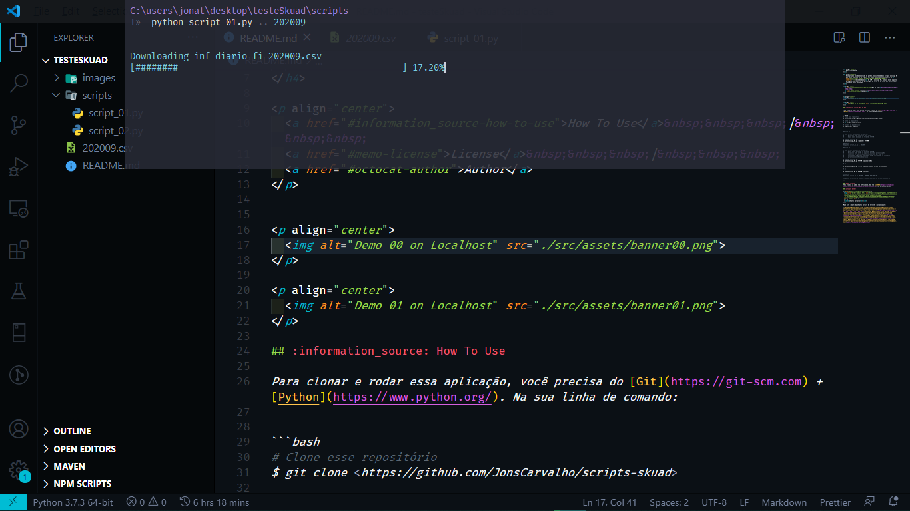

<h1 align="center">
    Exercícios Skuad
</h1>

<h4 align="center">
    Esse projeto foi desenvolvido em python. Consiste em dois scrips, o script 01 que faz o download de um arquivo CSV sobre fundos de investimentos na <a href="http://dados.cvm.gov.br/dados/FI/DOC/INF_DIARIO/DADOS/" itemprop="url">base de dados</a> da CVM e o script 02, que usa esses arquivos para gerar um relatório da porcentagem de variação do valor das cotas, valor captado e valor resgatado.
</h4>

<p align="center">
  <a href="#information_source-how-to-use">How To Use</a>&nbsp;&nbsp;&nbsp;|&nbsp;&nbsp;&nbsp;
  <a href="#memo-license">License</a>&nbsp;&nbsp;&nbsp;|&nbsp;&nbsp;&nbsp;
  <a href="#octocat-author">Author</a>
</p>


<p align="center">
  
</p>

## :information_source: How To Use

Para clonar e rodar essa aplicação, você precisa do [Git](https://git-scm.com) + [Python](https://www.python.org/). Na sua linha de comando:


```bash
# Clone esse repositório
$ git clone <https://github.com/JonsCarvalho/scripts-skuad>

# Entre no repositório
$ cd scripts-skuad/scripts

# Instale as dependências
$ pip install requests


#Script 01

# Esse script recebe dois parâmetros:
#    - O caminho onde o arquivo será salvo
#    - O ano e mês desejado no formatdo YYYYMM

# Rodando o script 01
$ python script_01.py <caminho> YYYYMM

#Exemplo
#$ python script_01.py .. 202009

#Script 02

# Esse script recebe três parâmetros:
#    - O ano e mês desejado no formatdo YYYYMM
#    - O caminho onde estão os arquivos baixados pelo scrip 01
#    - E um CNPJ ou uma lista de CNPJs separados por espaço. 
#      Caso nenhum CNPJ seja informado, então será gerado um relatório
#      para todos os CNPJs do arquivo

# Rodando o script 02
$ python script_02.py YYYYMM <caminho> CNPJ

# ou

$ python script_02.py YYYYMM <caminho> CNPJ_1 CNPJ_2 CNPJ_3 CNPJ_4

# ou

$ python script_02.py YYYYMM <caminho>

#Exemplo
#$ python script_02.py 202009 .. 00.000.000/0000-00

#$ python script_02.py 202009 .. 00.000.000/0000-00 00.000.000/0000-00 

```

## :memo: License
This project is under the MIT license. See the [LICENSE](https://github.com/JonsCarvalho/scripts-skuad/blob/master/LICENSE.md) for more information.

## :octocat: Author

<a href="https://github.com/JonsCarvalho/">
 
 <br />
 <sub><b>Jônatas Carvalho</b></sub>
</a>

Made with :heart: by Jônatas Moreira de Carvalho :vulcan_salute:

[](https://www.facebook.com/J.o.n.a.t.a.s.C.a.r.v.a.l.h.o.w/) [](https://www.instagram.com/jonscarvalho/) [](https://www.linkedin.com/in/jonscarvalho/) [](mailto:jonatascarvalhow@gmail.com)

